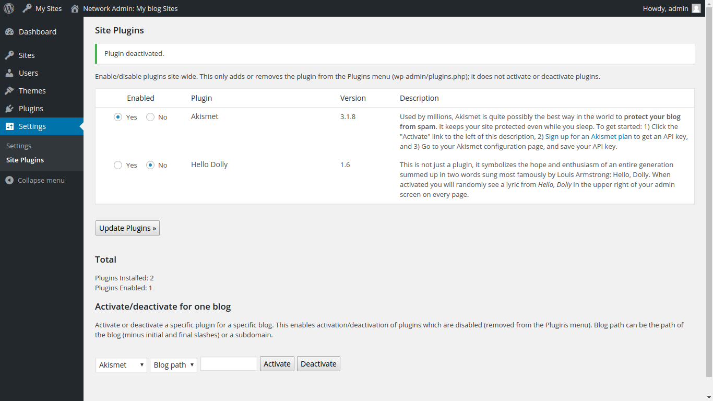

Wordpress Site Plugins
--
Creates a Site Plugins page, much like the Site Themes page (wp-admin/wpmu-themes.php) that comes with Wordpress MU.  Allows admins to remove plugins from Plugins page sitewide (wp-admin/plugins.php) as well as to activate or deactivate a specific plugin for a specific blog (useful when plugins have been disabled).

Installation:

1. Create an mu-plugins folder in wp-content, if it doesn't exist already
2. Copy site-plugins.php to wp-content/mu-plugins
3. To access: *Network Admin* → *Settings* → *Site Plugins*

Tested with:

- Wordpress 4.4.2
- Wordpress 3.1.4

Screenshot:

